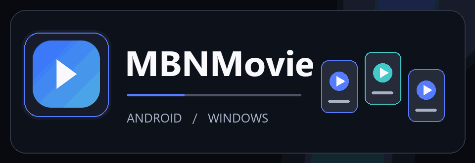

# ام‌بی‌ان‌مووی | MBNMovie

**فیلم و سریال بعدی‌ات را همین‌جا پیدا کن**

🎞️ فیلم &nbsp;·&nbsp; 📺 سریال &nbsp;·&nbsp; 📥 دانلود &nbsp;·&nbsp; ⭐ فهرست‌های شخصی

[دریافت برای اندروید و ویندوز](https://github.com/MBNpro-ir/MBNMovie-App/releases/latest)

---

## از انتخاب تا تماشا

| کشف کن | تماشا کن | برای بعد نگه دار |
| :---: | :---: | :---: |
| 🔎 جست‌وجوی فیلم و سریال | ▶️ پخش درون برنامه با زیرنویس | ❤️ علاقه‌مندی‌ها و ادامهٔ تماشا |
| 🎭 مرور ژانرها، کشورها و بازیگران | 📺 تماشا روی نمایشگر سازگار | 📚 ساخت پلی‌لیست و مدیریت دانلودها |

## شروع در سه قدم

1. از دکمهٔ **دریافت** در بالای صفحه، نسخهٔ مناسب دستگاهت را نصب کن.
2. با **ایمیل، نام کاربری یا شمارهٔ تأییدشده** وارد شو. اگر حساب نداری، با ایمیل یا نام کاربری ثبت‌نام کن؛ شمارهٔ موبایل اختیاری است.
3. بین فیلم‌ها و سریال‌ها بگرد، اطلاعات عنوان را ببین و تماشا را شروع کن.

> نمایش محتوا و امکان پخش یا دانلود به دسترسی حساب و آماده بودن لینک‌های هر عنوان بستگی دارد.

اگر شماره ثبت نکنی، می‌توانی با حساب مهمان از برنامه استفاده کنی و هر زمان خواستی شماره‌ات را با کد پیامکی تأیید کنی.

## برای هر سلیقه، یک مسیر

- **جست‌وجو و مرور:** عنوان دلخواهت را پیدا کن یا از میان دسته‌ها و آثار بازیگران انتخاب کن.
- **پلی‌لیست‌های شخصی:** فیلم‌ها و سریال‌هایی را که دوست داری در فهرست‌های خودت جمع کن.
- **تماشای پیوسته:** از «ادامهٔ تماشا» برگرد و باقی فیلم یا قسمت را ببین.
- **روی دستگاه دلخواه:** در اندروید از تصویر در تصویر و در ویندوز از کنترل‌های صفحه‌کلید استفاده کن؛ پخش روی نمایشگر دیگر به سازگاری دستگاه بستگی دارد.

## اشتراک و پشتیبانی

در منوی برنامه، **مدیریت اشتراک** وضعیت اشتراک و زمان باقی‌مانده را نشان می‌دهد. برای کمک دربارهٔ حساب، پخش یا دانلود، دکمهٔ **پشتیبانی** همان بخش را بزن.

## به‌روزرسانی برنامه

وقتی نسخهٔ تازهٔ ضروری شناسایی شود، صفحهٔ به‌روزرسانی تا نصب آن باز می‌ماند و بخش‌های دیگر برنامه در دسترس نیستند. در اندروید، ممکن است لازم باشد نصب را در پنجرهٔ سیستم تأیید کنی. اگر دریافت کامل نشد، از همان صفحه دوباره تلاش کن.

**برای انتخاب بعدی آماده‌ای؟**

[دریافت آخرین نسخه](https://github.com/MBNpro-ir/MBNMovie-App/releases/latest)

